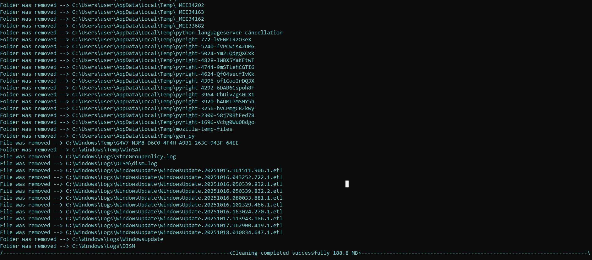

# 🌟 Windows Cleaner

<br><br>

## en
cleaner — offers both regular and deep cleaning.

---

## 🚀 Possibilities

- ✅ Regular and deep cleaning
- ⚙️ Easy to use and expand

---

## 🧰 Installation

```bash
# Clone the repository
git clone https://github.com/cpythonkiller/Windows-Cleaner.git

# Install depending
pip install elevate

# Launch
python cleaner.py
```

<br><br>




<br><br><br>


## ru
cleaner — есть обычная и глубокая очистка

---

## 🚀 Возможности

- ✅ Обычная и глубокая очистка
- ⚙️ Простой в использовании и расширяемый

---

## 🧰 Установка

```bash
# Клонируй репозиторий
git clone https://github.com/cpythonkiller/Windows-Cleaner.git

# Установи зависимости
pip install elevate

# Запуск
python cleaner.py
```

<br><br>


